## How to run

You should have Python installed on your device.
The program is tested on Python 3.14.
Other versions may work but not guaranteed.

1. **Clone the repository**
   ```shell
   git clone https://github.com/ShingZhanho/COMP1110-Project-26Spring.git
   cd COMP1110-Project-26Spring
   ```
2. **Install Python dependencies** (installing packages in a virtual environment is recommended)
   ```shell
   pip install -r requirements.txt
   ```
3. **Start the program**
   ```shell
   python -m campus_nav
   ```

## How to use

The campus navigator app is built with the library Textual, supporting both keyboard and mouse interaction.
Upon launching the app, you should see the following screen:

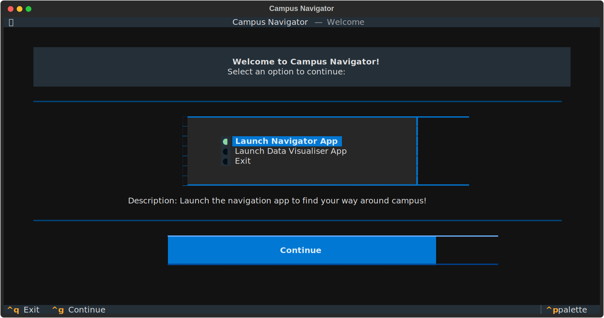

Click "continue" to access to the navigator

You can set your waypoints, preferences and configuration in this interface

For the "waypoints" part, you can use "Edit" to set the start point and end point. And you can use "ADD" and "Remove" to add and remove passing points.

For the "Preferences" part, you can choose your prederence here. After you choose the preference, the "X" will turn to green.

For the "Configuration" part, you can set your set your relative walking speed here.

After setting all the things here, you can click "go" in the bottom.

Then, you can get all the routes that meet your requirements.

You can click" "Details" to view the detail of the route.

## Features

### Realistic Speed Multiplier Modeling

Our routing engine includes a **Speed Multiplier** feature that allows users to adjust their expected walking pace (e.g., walking 1.5x faster or 0.8x slower). However, rather than applying a flat rate to the entire journey, we explicitly modeled real-world physical constraints. 

The speed multiplier mathematically affects different edge types using distinct exponents (`_SPEED_EXPONENTS`):

* **Flat Paths (Exponent: 1.0):** Scales directly with the user's walking speed.
* **Stairs (Exponent: 1.5) & Minor Stairs (Exponent: 1.3):** Highly sensitive to speed changes. This models the significant physical exertion required to climb stairs faster.
* **Escalators (Exponent: 0.3):** Only slightly affected. While users can walk on a moving escalator to save some time, the mechanical speed of the escalator dominates the total time cost.
* **Lifts (Exponent: 0.0):** Completely unaffected by the speed multiplier. Since a lift operates at a fixed mechanical speed, any mathematical calculation (`speed_multiplier ** 0.0`) evaluates to `1.0`, keeping the lift traversal time perfectly constant regardless of the user's pace.

This design demonstrates our focus on translating everyday life phenomena into structured computational models.

### Accessible Route Generation ♿
Designed for wheelchair users, individuals with strollers, or anyone requiring step-free access, our application features a dedicated **Accessible Route** mode. 

* **Smart Preference Overrides:** Toggling the "Accessible Route" option in the configuration screen automatically enforces strict routing constraints. It disables incompatible preferences to ensure user safety and compliance with accessibility needs.
* **Algorithmic Graph Adjustment:** Under the hood, the routing engine dynamically updates the weights of our campus graph. Path edges with stairs (`STAIRS`, `MINOR_STAIRS`) or escalators (`ESCALATOR`) are assigned an infinite traversal cost (`_INF`), completely avoiding them during the pathfinding process.
* **Lift Prioritization:** The Dijkstra-based pathfinding algorithm is weighted to prioritize elevators (`LIFT`) by applying a favorable `_PREFERENCE_FACTOR`, guaranteeing the most efficient step-free navigation across different campus elevations.

## Each File Purpose

#### Root Directory
- **pyproject.toml / requirements.txt / requirements-dev.txt**: Define project metadata, build systems, and Python dependencies required to run and develop the application.
- **.gitignore**: Specifies intentionally untracked files to ignore (e.g., compiled Python files, virtual environments).
- **.github/workflows/**: Contains CI/CD pipelines for automating Python code checks, fetching data, and compiling LaTeX PDFs.

#### campus_nav/
- **__main__.py**: The global entry point of the project. It launches the `AppSelector` to let the user choose between the navigator and the data visualiser.
- **app_selector.py**: Provides the initial startup UI that allows users to select which sub-application to launch.
- **app_selector.tcss**: The Textual stylesheet defining the layout and styling for the app selector screen.
- **constants.py**: Stores global constants and configuration paths used throughout the application.
- **utils.py**: Contains shared utility and helper functions.

#### campus_nav/data/
- The two files under this route are datas for the navigator.

#### campus_nav/data_visualiser/
- **__init__.py**: Initializes the data visualiser submodule.
- **data_visualiser_app.py**: The main application class for the map data visualiser tool.
- **data_visualiser_app.tcss**: The stylesheet for arranging widgets in the visualiser application.
- **data_store.py**: Manages and processes the graph data specifically for visualization purposes.
- **gui_window.py**: Handles the graphical user interface window for the graph rendering.
- **web_assets/**: Contains the HTML template and bundled JavaScript libraries (e.g., Sigma.js) required to render the graph visually.

#### campus_nav/main_app/
- **__init__.py**: Imports MainApp from the submodule .main_app.
- **__main__.py**: Entry point of the application.
- **main_app.py**: The main window class of the navigator.
- **main_app.tcss**: Arrange the widgets in the Screen container.
- **route_engine.py**: The routing engine of the navigator. Compute optimal campus navigation routes based on user's requirements.

#### campus_nav/main_app/screens/
- **waypoint_selection_screen.py & .tcss**: The interface for users to specify their start point, end point, and any intermediate passing points.
- **configuration_screen.py & .tcss**: The interface for users to adjust walking speed and select path preferences (e.g., avoiding stairs, preferring lifts).
- **solutions_screen.py & .tcss**: Displays the list of calculated candidate routes that satisfy the user's criteria.
- **route_details_screen.py & .tcss**: Shows the step-by-step navigation details and cost breakdown of a selected route.

#### campus_nav/models/
- **__init__.py**: Import core classes.
- **campus_map.py**: Define the CampusMap class to represent and manage an undirected multigraph structure of the campus map.
- **edge.py**: Define the edge class, representing the connections between two nodes in the campus.
- **edge_type.py**: Define the edge type class, representing the type of edge between two nodes.
- **node.py**: Define the node class, storing the information related to the nodes.

#### Documentation & Reports
- **project_plan/**: Contains the LaTeX source code and settings for the project plan document.
- **project_report/**: Contains the LaTeX source code, output figures (`figs/`), and shell scripts (`pre_build.sh`) used to compile the final project report.
- **images/**: Stores image assets like screenshots used in this README.

## Sample Test Cases

### Basic Path Planning

| ID        | Description           | Status |
| :-------- | :-------------------- | :----: |
| **TC-01** | Normal shortest path  |   ✅    |
| **TC-02** | Adding passing points |   ✅    |
| **TC-03** | Start = End           |   ✅    |

<details>
<summary><b>See detailed results in Basic Path Planning</b></summary>
<br>

**TC-01: Normal shortest path**

* **Input:**
  * **Start:** `CYMAmenitiesCtr_CYMCanteen`
  * **End:** `LawLibrary`
  * **Preferences:** `avoid stairs`
  * **Config:** `speed multiplier: 1.0`
* **Expected Output:** Returns path, stops, edges and time (without stairs).
* **Actual Result:** Three routes are output, each with a "no stairs" tag. When entering Details, the complete path can be seen, which matches reality.
* **Screenshots:**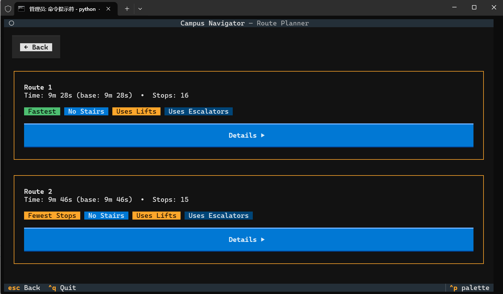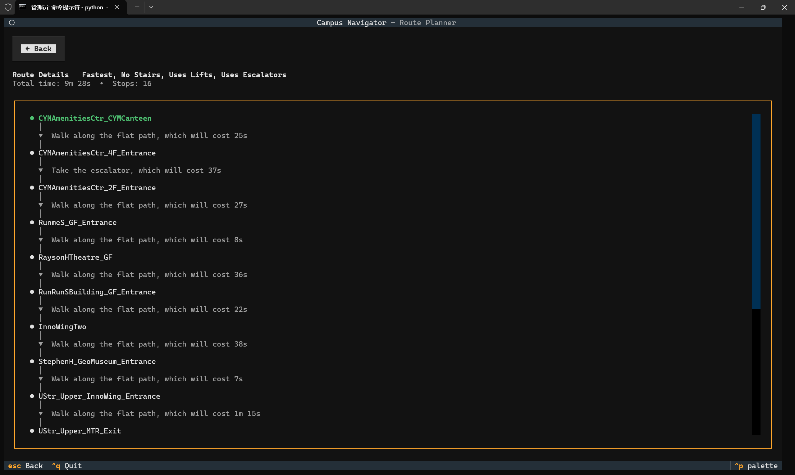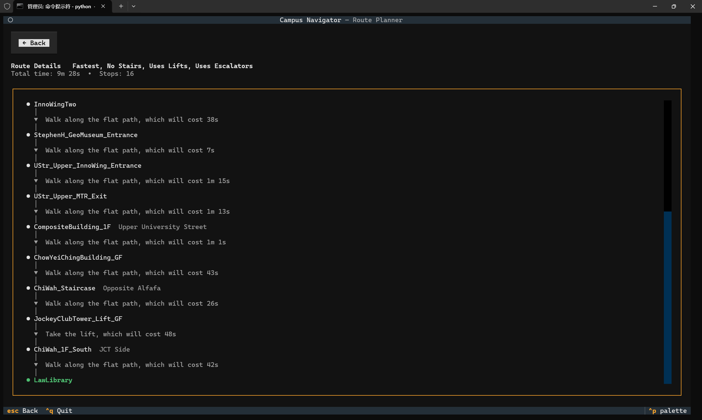

---

**TC-02: Adding passing points**
* **Input:**
  * **Start:** `CYMAmenitiesCtr_CYMCanteen`
  * **Passing Point:** `KKLeung_Building_LG2F`
  * **End:** `Swire_Building`
* **Expected Output:** The output route must pass through the point `KKLeung_Building_LG2F`.
* **Actual Result:** Two routes are output. In the details, the three locations `CYMAmenitiesCtr_CYMCanteen`, `KKLeung_Building_LG2F`, and `Swire_Building` all appear and are marked in green.
* **Screenshots:**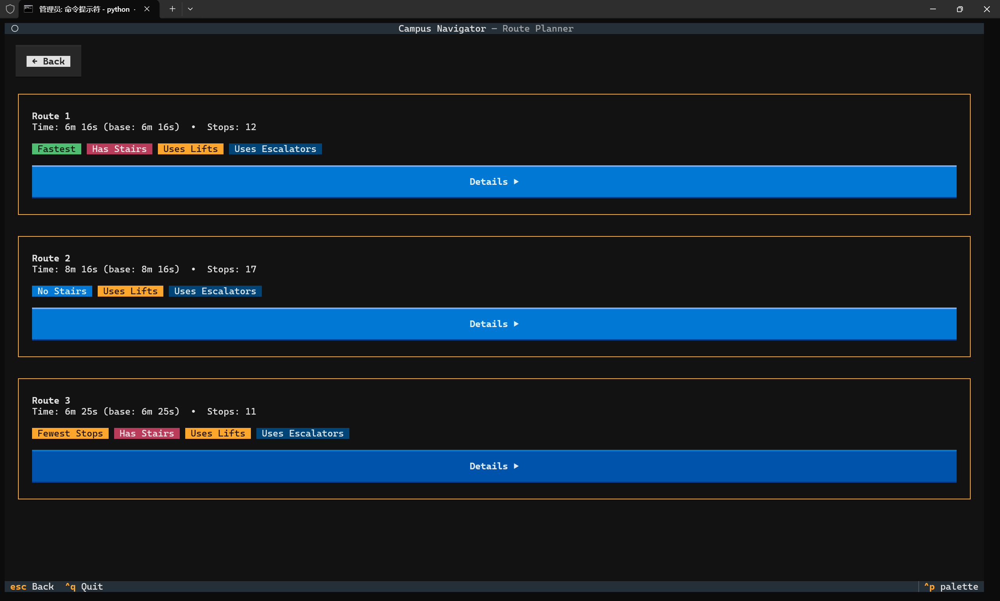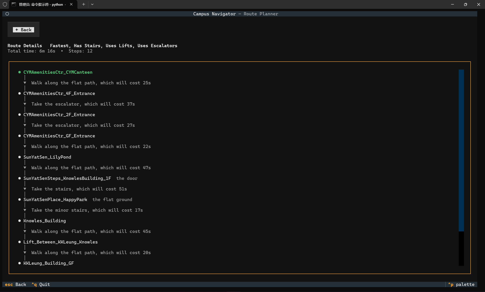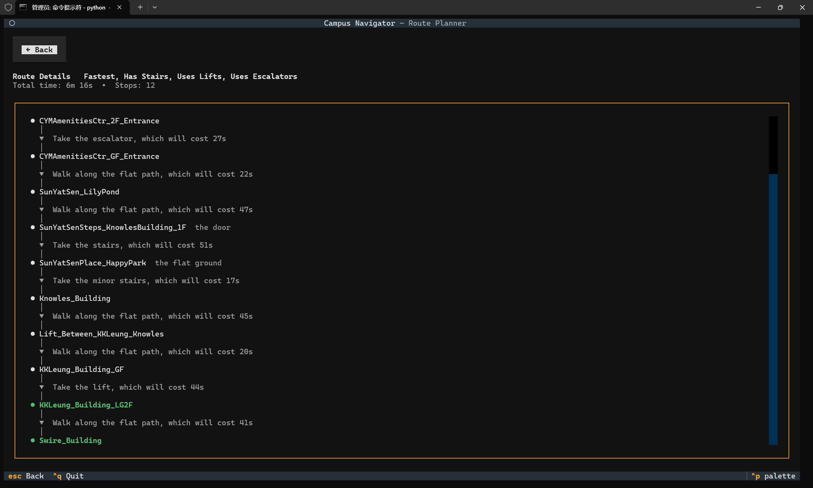

---

**TC-03: Start = End**
* **Input:**
  * **Start:** `Bookstore`
  * **End:** `Bookstore`
* **Expected Output:** Users cannot select the same point for Start and End in the waypoint interface.
* **Actual Result:** Same as expected.
* **Screenshots:** 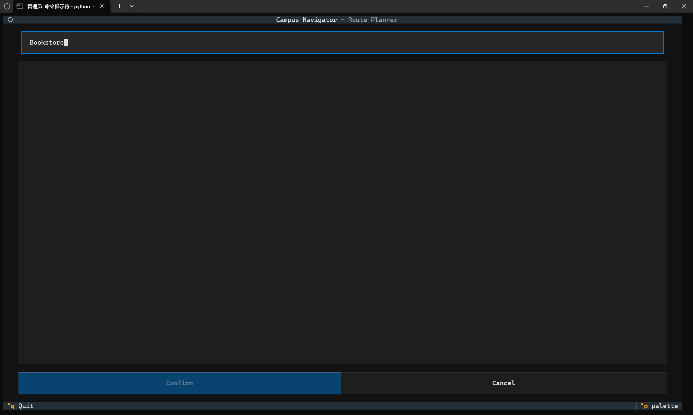

</details>

<br>

### Preferences and Configuration

| ID        | Description                         | Status |
| :-------- | :---------------------------------- | :----: |
| **TC-04** | Modify the walking speed multiplier |   ✅    |
| **TC-05** | Select one preference               |   ✅    |
| **TC-06** | Select more than one preference     |   ✅    |
| **TC-07** | Select Accessible Route             |   ✅    |

<details>
<summary><b>See detailed results in Preferences and Configuration</b></summary>
<br>

**TC-04: Modify the walking speed multiplier**

* **Input:**
  * **Start:** `Library_Extension`
  * **End:** `ChiWah_1F_North`
  * **Config:** `Speed Multiplier = 1.5`
* **Expected Output:** The speed multiplier is designed to only affect pedestrian-dependent edges (like flat paths and stairs). Lift times remain unchanged regardless of the speed multiplier because a lift's mechanical speed is independent of the user's walking pace. In the code, this is achieved by applying an exponent of `0.0` to lift edges, making the effective multiplier constantly `1.0`. So the estimated time should not just be 2/3 of the normal estimated time.
* **Actual Result:** When the speed multiplier is `1.0` (default state), the time is 8 minute and 45 seconds; when the speed multiplier is `1.5`, the time is 5 minute and 34 seconds.
* **Screenshots:**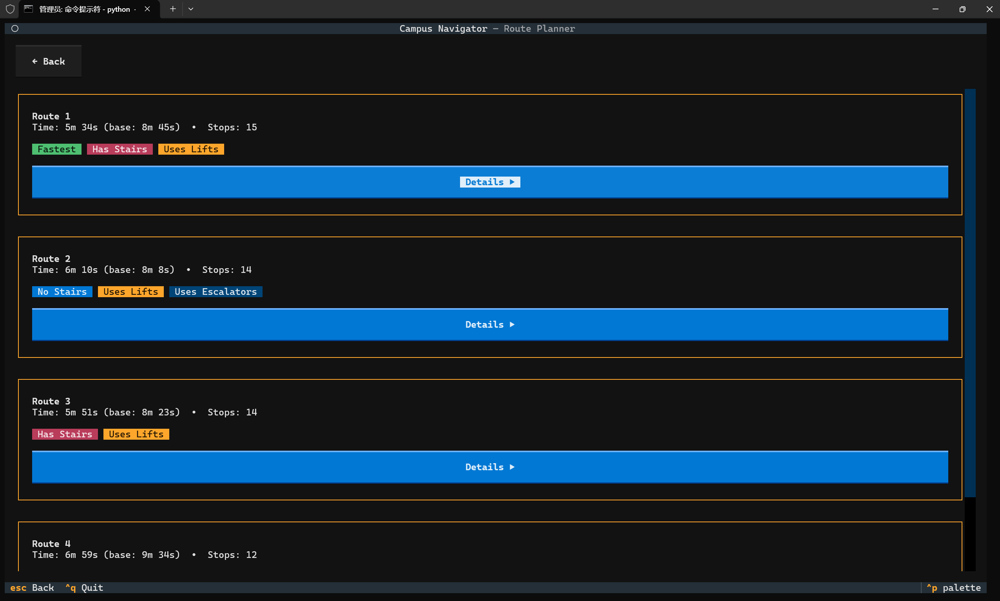

---

**TC-05: Select one preference**

* **Input:**
  * **Start:** `Library_Extension`
  * **End:** `ChiWah_1F_North`
  * **Preferences:** `Avoid Stairs`
* **Expected Output:** No stairs in the output routes.
* **Actual Result:** Output three routes. None of the three routes have stairs, and Route 1 is the fastest.
* **Screenshots:**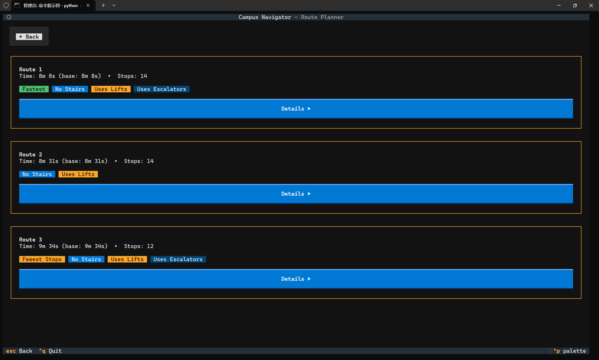

---

**TC-06: Select more than one preference**

* **Input:**
  * **Start:** `Library_Extension`
  * **End:** `ChiWah_1F_North`
  * **Preferences:** `Prefer Stair` and `Avoid Escalators`
* **Expected Output:** Return routes without escalators and with stairs.
* **Actual Result:** Output three routes. The first route has stairs and no escalators. The other two routes also have no escalators, but due to constraints, they have no stairs either. Route 2 is the fastest.
* **Screenshots:**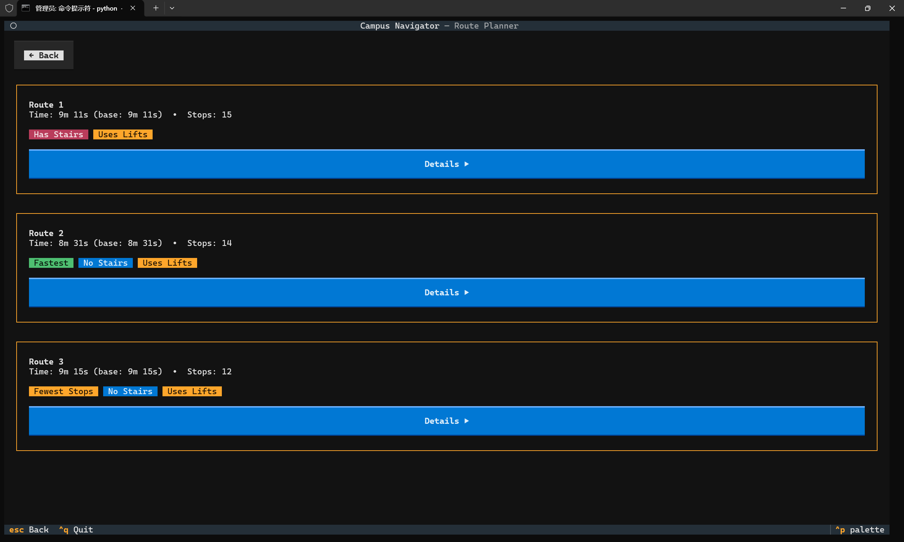

---

**TC-07: Select Accessible Route**
* **Input:**
  * **Start:** `Library_Extension`
  * **End:** `RedWall`
  * **Preferences:** `Accessible Route`
* **Expected Output:** When `Accessible Route` is selected, the UI should automatically lock and check `Avoid Stairs`, `Avoid Escalators`, and `Prefer Lifts`. The output routes must not contain any stairs or escalators, and should prioritize lifts.
* **Actual Result:** The UI checkboxes updated automatically. The generated routes successfully bypassed all stairs and escalators, using only flat paths and lifts. 
* **Screenshots:**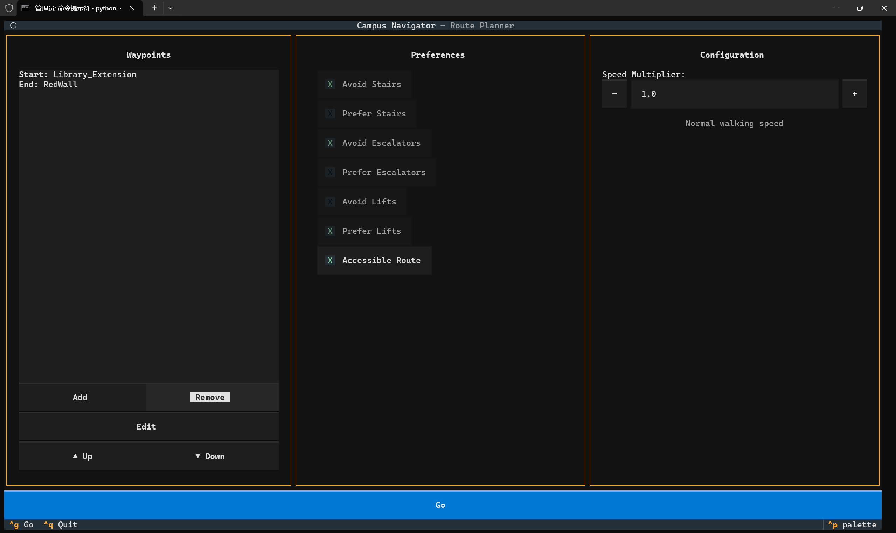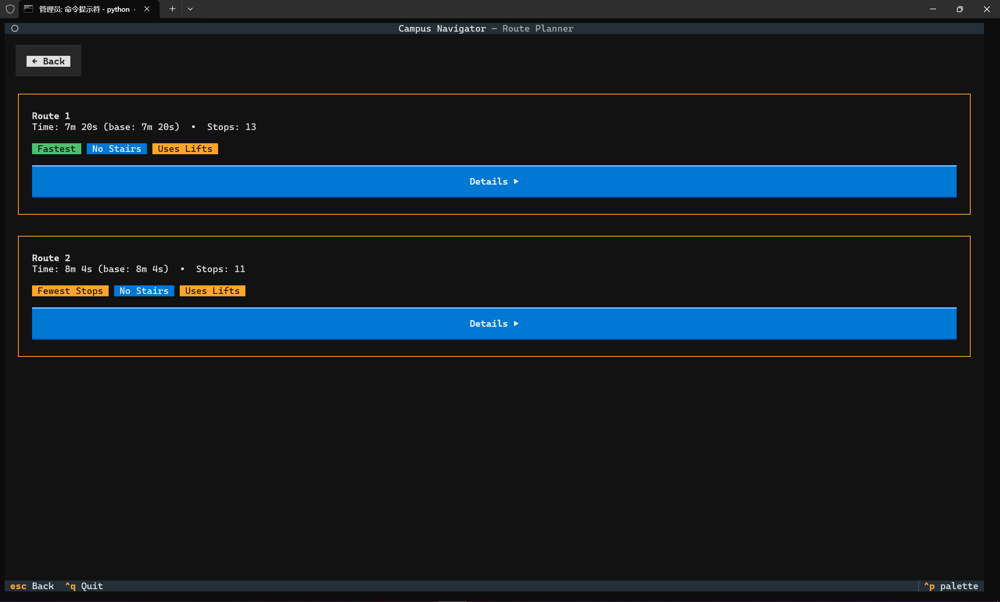

</details>

### Boundary & Exception Handling

| ID        | Description                                       | Status |
| :-------- | :------------------------------------------------ | :----: |
| **TC-08** | Unreachable destination due to strict preferences |   ✅    |
| **TC-09** | Extreme speed multiplier values                   |   ✅    |
| **TC-10** | Conflicting preferences                           |   ✅    |

<details>
<summary><b>See detailed results in Boundary & Exception Handling</b></summary>
<br>
**TC-08: Unreachable destination due to strict preferences**

* **Input:**
  * **Start:** `JockeyClubTower_Lift_GF`
  * **End:** `JockeyClubTower_Lift_LGF`
  * **Preferences:** `Avoid Stairs`, `Avoid Lifts`, and `Avoid Escalators`
* **Expected Output:** The system should not crash. It should gracefully handle the fact that `_dijkstra` returns `None` and display a user-friendly message "No routes found. Try adjusting your preferences.
* **Actual Result:** No routes found. Try adjusting your preferences.
* **Screenshots:** 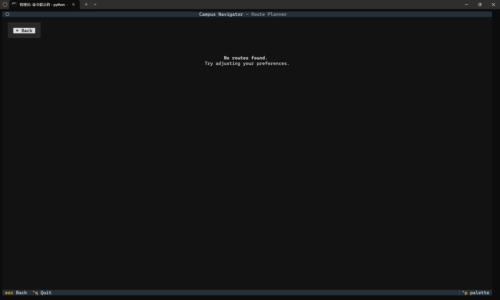

---

**TC-09: Extreme speed multiplier values**

* **Input:**
  * **Start:** `Library_Extension`
  * **End:** `ChiWah_1F_North`
  * **Config:** `Speed Multiplier = 0.000000000000000000001`
* **Expected Output:** The time calculation should not result in `ZeroDivisionError`. The formatting function `format_time` should handle very large numbers of seconds correctly.
* **Actual Result:** The estimated time is correctly demonstrated.
* **Screenshots:** 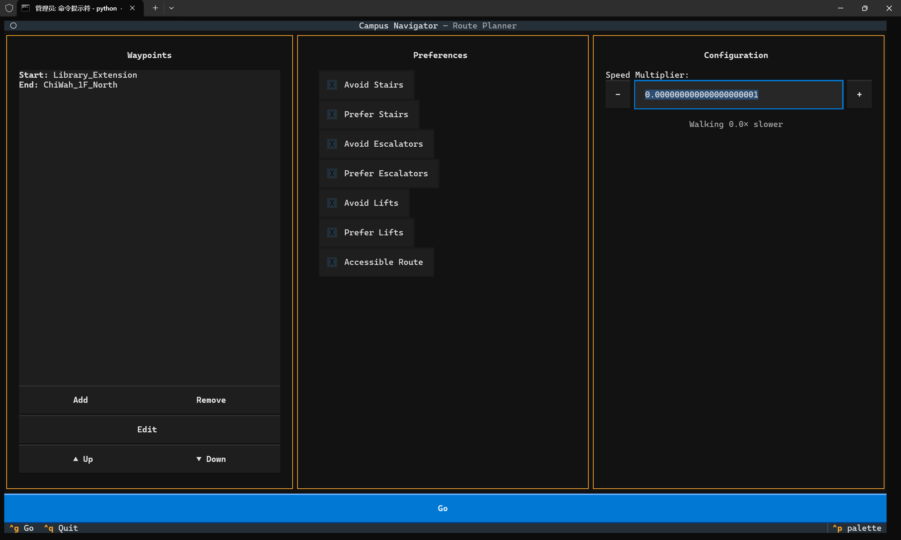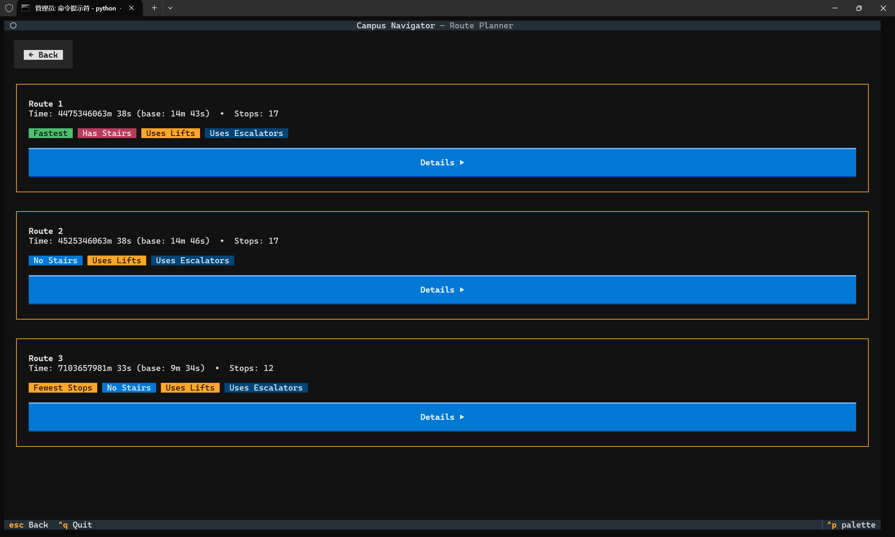

---

**TC-10: Conflicting preferences**
* **Input:**
  * **Start:** `Library_Extension`
  * **End:** `ChiWah_1F_North`
  * **Preferences:** Select both `Prefer Stairs` and `Avoid Stairs` simultaneously.
* **Expected Output:** The system should resolve the conflict predictably. Based on the `_cost_fn_for_strategy` logic, avoidance returns `_INF` before preference is calculated, so "Avoid" should naturally override "Prefer". The output route must not contain stairs.
* **Actual Result:** Impossible to choose these two options at the same time.
* **Screenshots:** 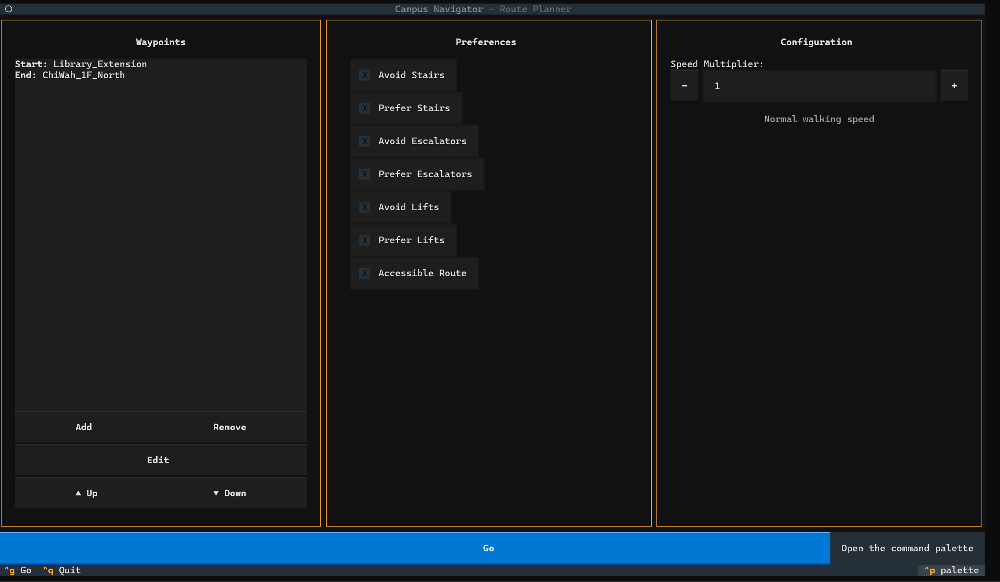

</details>
